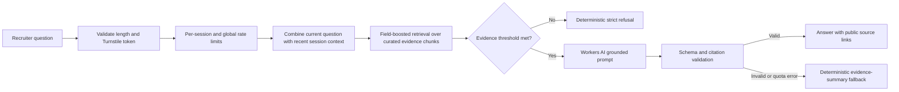

# Recruiter Portfolio Product and Architecture Specification

**Status:** Approved for implementation<br>
**Date:** 2026-08-14<br>
**Repository:** `Mohamed-Nader555/mohamed-hafez-portfolio`<br>
**Public name:** Mohamed Hafez

## 1. Executive decision

Build one unified, evidence-led portfolio with four recruiter lenses:

1. AI/ML Engineer — the default lens and primary narrative.
2. Software Engineer — the systems and product-engineering foundation.
3. Android Developer — shipped mobile/client work and device integration.
4. TA / Instructor — teaching, mentoring, and technical communication.

These are not four independent sites. They are four curated views over the same verified evidence model. Each lens changes the opening summary, project ordering, capability emphasis, metadata, analytics context, and résumé download while retaining one identity and one navigation system.

The experience uses the approved **Research Console × Electric Studio** direction: evidence-first information architecture, deep navy surfaces, cyan evidence/navigation signals, restrained neon-magenta AI states, glass depth, and controlled motion. It must be equally polished on desktop, laptop, tablet, and smartphone; no device receives a reduced feature set.

## 2. Product goal and success criteria

The site exists to move a recruiter from uncertainty to action quickly. Within roughly 60 seconds, a recruiter should be able to determine:

- what Mohamed does and which role lens fits the opening;
- what he built, what he personally owned, and what results are verifiable;
- whether he has the location, availability, and Canadian work authorization required;
- which role-specific résumé to download;
- how to contact him directly; and
- how to ask a grounded follow-up question without searching through documents.

Primary conversion signals are contact clicks and matching-résumé downloads. Supporting signals are case-study engagement, recruiter-lens selection, GitHub/LinkedIn clicks, and successful AI-assisted questions.

The site must avoid generic portfolio conventions that dilute evidence: decorative skill clouds, vague self-ratings, an undifferentiated grid of every GitHub repository, a terminal-only interface, heavy 3D, and animation that competes with reading.

## 3. Ground-truth and publishing policy

### 3.1 Evidence precedence

When sources disagree, use this order:

1. Direct confirmations Mohamed gave during discovery.
2. Official institutional records, including YorkSpace.
3. The current role-specific résumés.
4. Approved supplementary files and presentations.
5. Public repository code and repository documentation.
6. Older portfolio copy only as a lead to re-verify, never as final authority.

Every public metric or factual claim must carry an internal `sourceIds` reference. Prominent research claims should expose a human-readable source link in the UI.

### 3.2 Locked attribution and status rules

- Display the public name **Mohamed Hafez**. Keep `Mohamed-Nader555` only where it is the actual GitHub handle.
- The M.A. in Information Systems & Technology at York University is completed and officially awarded in 2026.
- The thesis title is **“ASC-PIE: An Evaluation Framework for PII-Aware Named-Entity Recognition.”** Link the [YorkSpace record](https://yorkspace.library.yorku.ca/items/379ae5c1-63dc-4036-bd47-f27a01cd195e) and the [permanent handle](https://hdl.handle.net/10315/43932).
- Describe SPRINT-PP as a research paper **submitted and under review**. Never imply publication, acceptance, or completed peer review.
- Describe Northstar as an independently built, end-to-end RAG engineering project demonstrating grounded retrieval, citations, refusal behavior, evaluation, testing, and Docker deployment. Do not frame it publicly as an assessment.
- Present Dive as a client project owned and implemented end to end by Mohamed. Do not attribute it to a presenter or unrelated collaborator anywhere in public content, metadata, alt text, source records, or AI knowledge.
- Describe Mercato as a football-talent platform.
- Historical Google Play claims must say the apps were previously published under client-owned listings and are no longer available because the clients did not continue maintenance or request updates. Never render a current “Get it on Google Play” action.
- Describe CEH only as training. Mohamed did not receive an official CEH certification.
- The supplied project screenshots are approved for public portfolio use.
- Do not add a headshot or testimonial section in the initial release.
- The BASS experience may be discussed using the approved source material, while unrelated private or operational data remains excluded.

### 3.3 Public and private files

Public repository assets may include:

- four current role-specific résumé PDFs;
- approved project screenshots and optimized derivatives;
- curated case-study copy;
- public institutional and selected GitHub links; and
- structured evidence records containing facts approved for publication.

Do not commit or serve:

- the master CV or comprehensive profile;
- raw supplementary PDFs or presentation source files unless explicitly promoted later;
- private notes, source dumps, or local extraction output;
- raw chat questions, full chat responses, analytics exports, or visitor-identifying data;
- secrets, credentials, service-account files, app-signing keys, `.env`, or `.dev.vars` files.

Supplementary files can inform curated public facts. AI citations must resolve to polished public pages, a selected public repository, a role résumé, or the official thesis record—not to a private raw source.

## 4. Information architecture

### 4.1 Route map

| Route | Purpose |
|---|---|
| `/` | Default AI/ML recruiter lens and primary share URL |
| `/software` | Software Engineer lens using the shared site shell and evidence model |
| `/android` | Android Developer lens |
| `/teaching` | TA / Instructor lens |
| `/work` | Filterable, curated work index; never an “all repositories” dump |
| `/work/[slug]` | Evidence-led case-study pages |
| `/research/asc-pie` | Thesis and ASC-PIE research narrative, including SPRINT-PP’s under-review status |
| `/experience` | Professional experience and responsibility scope |
| `/about` | Concise career narrative, education, availability, and work authorization |
| `/privacy` | Plain-language analytics and AI data-use disclosure with analytics opt-out |
| `/api/chat` | On-demand Cloudflare Worker route for grounded answers |
| `/api/events` | First-party privacy-safe analytics event endpoint |

The role routes are tailored entry points, not separate products. Components, facts, project records, and layout remain shared. Each route has its own title, description, Open Graph copy, default project order, and matching résumé.

### 4.2 Homepage/lens hierarchy

1. Global identity and compact navigation.
2. Recruiter-lens selector with current role made explicit.
3. Hero thesis, availability/work-authorization signals, contact action, and matching résumé.
4. “60-second evidence” panel with only source-backed proof.
5. Role-ranked case studies.
6. Professional experience and capability evidence.
7. Research and teaching depth.
8. Direct contact block with email, phone, LinkedIn, and GitHub.
9. Persistent but non-obstructive AI entry point.

### 4.3 Lens-specific prioritization

| Lens | Primary evidence | Supporting evidence |
|---|---|---|
| AI/ML | ASC-PIE + SPRINT-PP, Northstar RAG, Mind’s Eye, Dive | applied ML repositories, software delivery, teaching |
| Software | Northstar RAG, BASS engineering, Dive, Dostava | ASC-PIE pipeline rigor, Android systems, teaching |
| Android | Mind’s Eye, Dive, Dostava, Mercato | other historical client apps, APIs/data layers, software foundation |
| Teaching | teaching/TA experience, curriculum and mentorship evidence, technical breadth | ASC-PIE research communication, security training, selected engineering projects |

Initial detailed case studies are ASC-PIE/SPRINT-PP, Northstar RAG, Mind’s Eye, Dive, and Dostava. BASS, Mercato, other Android applications, and teaching experiences appear as shorter evidence modules until future source updates justify deeper pages.

## 5. Case-study model

Every case study answers the recruiter’s practical questions in this order:

1. Context — what problem or client need existed.
2. Ownership — what Mohamed personally designed, implemented, integrated, tested, or delivered.
3. Constraints — privacy, data, device, performance, client, or research limitations.
4. Architecture — a compact diagram and relevant technology choices.
5. Implementation — key engineering decisions, not a library inventory.
6. Outcome — measured result or delivered capability, with source attribution.
7. Evidence — screenshots, official record, repository, résumé, or approved artifact.
8. Reflection — one concise lesson or next improvement where honest and useful.

Project cards show role relevance, ownership, a specific outcome/capability, and one clear action. They do not show invented percentages, ratings, or unverified user counts.

## 6. Visual and interaction direction

### 6.1 Design language

- Base: deep navy/ink surfaces with clear tonal separation.
- Evidence/navigation accent: cyan.
- AI/high-attention accent: neon magenta used sparingly.
- Success/verified state: restrained green.
- Typography: technical but readable—one expressive geometric display face and one neutral UI/body face, self-hosted as optimized WOFF2 files with appropriate licenses.
- Surface treatment: selective glass depth and subtle grid/gradient texture, never a wall of identical glass cards.
- Content density: research-console precision with editorial breathing room.

### 6.2 Motion

Use slow ambient gradients, short content reveals, responsive hover/focus states, evidence-chart motion, and clear lens transitions. Do not use scroll hijacking, continuous cursor effects, heavy 3D, autoplay media, or constant element motion. Honor `prefers-reduced-motion` and make the reduced-motion version complete rather than merely slower.

### 6.3 Adaptive layouts

This is not a desktop-only site and not a mobile-first reduction. It is an adaptive system with equal functional quality:

- Desktop/laptop: wider evidence panels, persistent navigation, multi-column case studies, and a spacious assistant panel.
- Tablet: rebalanced one/two-column composition, wrapped lens controls, touch-sized navigation, and an assistant panel sized for portrait and landscape use.
- Smartphone: stacked evidence, compact navigation, full-width actions, and a chat sheet that accommodates the software keyboard without hiding input or citations.
- Large screens: constrain readable line length and content width; do not stretch cards across the viewport.

Validate at 320, 360, 390, 430, 768, 820, 1024, 1280, 1440, and 1920 CSS-pixel widths. Test at 200% zoom, portrait and landscape orientation, touch input, hardware keyboard, and screen reader/keyboard navigation.

## 7. Grounded AI assistant

### 7.1 User experience

The assistant is an open-ended recruiter-facing analyst, not a fixed FAQ and not an impersonation of Mohamed. It speaks in a professional, friendly, concise tone. It can answer supported questions about:

- projects, architecture, languages, frameworks, and technical decisions;
- professional experience and ownership;
- thesis/research, including precise publication status;
- Android/client work and historical release status;
- teaching, mentoring, and training;
- skills, education, location, availability, work authorization, sponsorship, working arrangement, relocation, and contact details.

It supports multi-turn follow-ups within the current browser session. It is English-only at launch. It does not perform job-description matching in the initial release.

### 7.2 Refusal policy

The assistant must refuse when retrieval does not provide adequate approved evidence. It must not infer private details, compensation expectations, opinions, personal history, client secrets, or facts about unsupported topics. It should say what it can answer and offer relevant supported directions.

A missing or invalid citation makes a generated response unusable. The server returns a deterministic refusal or evidence-summary fallback instead of an uncited answer.

### 7.3 Architecture options considered

| Approach | Benefits | Costs/risks | Decision |
|---|---|---|---|
| Static FAQ only | Cheapest and deterministic | Cannot answer open-ended recruiter questions | Rejected |
| Curated lexical RAG + Workers AI | Zero-cost-first, low latency, inspectable retrieval, no vector database required for a small corpus | Requires careful aliases and evaluation | **Launch recommendation** |
| Vectorize semantic RAG + Workers AI | Better semantic recall for vague queries | Extra embeddings, index lifecycle, quota usage, and operational complexity | Feature-flagged future enhancement if evaluation shows a recall gap |
| External LLM/vector service | Broad model choice and potentially higher capacity | Billing, API-key exposure risk, additional vendor/privacy surface | Provider-adapter option after launch, not default |

RAG means retrieved evidence augments generation; it does not require a vector database. The launch corpus is deliberately small, curated, and richly tagged, making field-boosted lexical retrieval plus aliases more predictable than an immediate vector stack.

### 7.4 Retrieval and generation flow



The build pipeline turns structured facts and case-study sections into small evidence chunks. Each chunk contains an ID, title, text, topic tags, role weights, aliases, public citation target, and sensitivity classification. A generated MiniSearch index is bundled for the Worker route. Retrieval boosts exact project names, aliases, skills, screening facts, and the active recruiter lens.

For follow-ups, retrieval uses the current question plus the previous two user messages and the previous answer’s cited source IDs. Conversation history remains in browser memory/session storage and is submitted only for the active exchange; it is not permanently stored.

### 7.5 Model and answer contract

Use a provider interface with Cloudflare Workers AI as the default. The initial model is `@cf/meta/llama-3.1-8b-instruct-fast`, verified against the free-plan catalog immediately before deployment. Keep the model ID in Cloudflare configuration so it can change without rewriting retrieval logic.

Request structured output containing:

- `answer`: concise supported prose;
- `citationIds`: only IDs present in the retrieved context;
- `answerStatus`: `answered` or `refused`;
- `followUps`: zero to three short supported suggestions.

Validate the response with Zod. Reject unknown citation IDs, empty citations for answered responses, overlong content, and malformed output.

### 7.6 Zero-budget behavior

Cloudflare currently provides 10,000 Workers AI neurons per day at no charge; the free allocation resets daily and requests fail after the limit is reached. Usage can be monitored in the Workers AI dashboard. The Worker free plan currently allows 100,000 dynamic requests per day, while matching static-asset requests are free and unlimited. These are platform limits, not promised recruiter traffic capacity. See [Workers AI pricing](https://developers.cloudflare.com/workers-ai/platform/pricing/), [Workers limits](https://developers.cloudflare.com/workers/platform/limits/), and [static asset billing](https://developers.cloudflare.com/workers/static-assets/billing-and-limitations/).

When AI capacity, quota, or the chosen model is unavailable, the portfolio remains live and retrieval returns a clearly labeled verified-facts fallback. No billing method is required at launch. If usage later justifies it, Mohamed can manually enable Workers Paid; there is no automatic upgrade in the design.

Cloudflare states that Workers AI customer content is not used to train models or improve Cloudflare/third-party services without explicit consent. See [Workers AI data usage](https://developers.cloudflare.com/workers-ai/platform/data-usage/).

### 7.7 Abuse controls

- Cloudflare Turnstile in managed mode, with mandatory server-side validation.
- A Workers rate-limiting binding for a session-key limit and a coarse global limit.
- Maximum question length of 600 characters.
- Maximum session history of six messages, trimmed server-side.
- Only plain text accepted; no file uploads, URLs to crawl, tools, or arbitrary browsing.
- Strict timeout and one generation call per accepted question.
- No IP address stored. Turnstile validation may use Cloudflare’s normal request processing, but the portfolio database does not persist the IP.

Turnstile is available free for typical personal/production sites, and its tokens must be validated server-side. See [Turnstile plans](https://developers.cloudflare.com/turnstile/plans/) and [server-side validation](https://developers.cloudflare.com/turnstile/get-started/server-side-validation/).

## 8. Analytics and privacy

### 8.1 Measurement split

Use Cloudflare Web Analytics for page traffic and Core Web Vitals. It is privacy-focused and does not track individual users across Cloudflare customers, but it does not currently support custom events. See [data collection](https://developers.cloudflare.com/web-analytics/data-metrics/data-origin-and-collection/) and the [custom-events FAQ](https://developers.cloudflare.com/web-analytics/faq/).

Use a first-party `/api/events` endpoint backed by Cloudflare D1 for custom recruiter actions. D1’s free tier is currently far beyond the expected launch volume: 5 million rows read/day, 100,000 rows written/day, and 5 GB total storage. See [D1 pricing](https://developers.cloudflare.com/d1/platform/pricing/).

### 8.2 Event taxonomy

Track only the following normalized events:

- `lens_selected`
- `case_study_opened`
- `resume_downloaded`
- `contact_clicked`
- `linkedin_clicked`
- `github_clicked`
- `chat_opened`
- `chat_submitted`
- `chat_answered`
- `chat_refused`
- `chat_fallback`
- `chat_error`

Permitted dimensions are route, lens, target/project ID, question category, outcome, source IDs, latency bucket, AI model ID, and a random browser-session ID hashed server-side. Do not store raw questions, raw answers, names, email addresses, phone numbers, exact IP addresses, full user agents, fingerprints, or cross-site identifiers.

Raw anonymous-session events expire after 30 days. Daily aggregate counts remain for 180 days. The privacy page explains the purpose and provides a local opt-out. Honor Global Privacy Control and `Do Not Track` by disabling custom event collection. Analytics never enables Mohamed to identify a recruiter or contact someone who did not choose a public contact action.

## 9. Technology architecture

### 9.1 Selected stack

- Node.js 22 LTS for CI/build compatibility; local Node 24 can run development, but CI pins Node 22 until platform support is verified.
- npm with a committed lockfile to avoid another global tool requirement.
- Astro with strict TypeScript and `@astrojs/cloudflare`.
- Pre-rendered pages/static assets, with on-demand `/api/chat` and `/api/events` routes.
- React only for interactive islands: recruiter lens transitions, AI assistant, and any data visualization that genuinely needs client state.
- Astro content collections + MDX + Zod for case studies and evidence validation.
- CSS layers and custom properties for the bespoke design system; no Tailwind dependency in the launch build.
- MiniSearch for the generated lexical evidence index.
- Cloudflare Workers AI, Turnstile, Workers rate-limiting binding, D1, Static Assets, and Web Analytics.
- Vitest, Testing Library, Playwright, axe-core, and Lighthouse CI.
- ESLint, Prettier, Astro Check, and Wrangler-generated binding types.

### 9.2 Runtime boundaries

- Public content pages are pre-rendered and served as static assets.
- The Worker runs only for AI chat, custom analytics events, and any required security response headers not covered by `_headers`.
- No CMS, authentication system, vector database, contact form, scheduler, or permanent chat storage is included at launch.
- Git is the content system. A content change requires a reviewed commit and rebuild.

### 9.3 Repository structure

```text
mohamed-hafez-portfolio/
├── .github/workflows/
├── docs/
│   ├── implementation/
│   └── superpowers/{specs,plans}/
├── migrations/
├── public/
│   ├── images/projects/
│   ├── resumes/
│   ├── _headers
│   └── _redirects
├── scripts/
│   ├── build-knowledge-index.ts
│   └── evaluate-retrieval.ts
├── src/
│   ├── components/{ai,analytics,case-study,layout,lenses,sections}/
│   ├── content/case-studies/
│   ├── data/{evidence,profile,projects,roles,screening,sources}/
│   ├── layouts/
│   ├── lib/{ai,analytics,rag,security}/
│   ├── pages/{api,work,research}/
│   ├── styles/
│   └── types/
├── tests/{e2e,fixtures,integration,unit}/
├── astro.config.mjs
├── wrangler.jsonc
├── package.json
├── package-lock.json
├── .dev.vars.example
└── README.md
```

This is one full-stack TypeScript repository, not a monorepo and not separate frontend/backend repositories.

## 10. Deployment and operational strategy

### 10.1 Environments

- Local: Wrangler/Astro development with Cloudflare test bindings and Turnstile test keys.
- Preview: automatic Cloudflare build for non-main branches or pull requests, using an isolated preview D1 database when persistence is exercised.
- Production: `main` branch to the free `workers.dev` hostname initially; a custom domain is attached later without changing application architecture.

Cloudflare’s current Workers Builds free plan includes 3,000 build minutes per month and one concurrent build, which is sufficient for this repository’s expected cadence. See [Workers Builds limits](https://developers.cloudflare.com/workers/ci-cd/builds/limits-and-pricing/).

### 10.2 Cloudflare setup requirements

Mohamed must create a free Cloudflare account and enable two-factor authentication. The setup runbook will then:

1. Connect the public GitHub repository to Cloudflare Workers Builds.
2. Create production and preview D1 databases and apply migrations.
3. Create a Turnstile widget for the production hostname.
4. Configure Workers AI, D1, rate-limit, and static-asset bindings.
5. Store the Turnstile secret through Cloudflare secrets; keep the sitekey public.
6. Enable Web Analytics.
7. Confirm the selected model remains available on Workers Free.
8. Deploy to the assigned `workers.dev` hostname.
9. Configure dashboard alerts/monitoring and verify that no paid plan is enabled.

The [Astro Cloudflare adapter](https://docs.astro.build/en/guides/integrations-guide/cloudflare/) supports on-demand routes and Cloudflare bindings while routing matching static assets directly.

### 10.3 Repository and secret policy

Commit:

- source code, content, tests, migrations, documentation, configuration schemas;
- `.env.example`/`.dev.vars.example` with fake values only;
- four role-specific public résumé PDFs and approved optimized images;
- `wrangler.jsonc` binding names, never secret values.

Never commit:

- `TURNSTILE_SECRET_KEY`, API tokens, GitHub/Cloudflare access tokens;
- `.env`, `.dev.vars`, `.wrangler`, generated build output;
- private source documents, raw analytics, local databases, signing keys, or copied credentials.

Run secret scanning in CI and keep GitHub push protection enabled. The known credential hygiene issues in unrelated older repositories are outside this repository and must never be copied here.

## 11. Accessibility, performance, SEO, and security

### 11.1 Accessibility

- Target WCAG 2.2 AA.
- Semantic landmarks and heading order.
- Full keyboard support, visible focus, skip link, and screen-reader labels.
- Minimum 44×44 CSS-pixel touch targets for primary mobile/tablet controls.
- Color meaning paired with text or iconography.
- Accessible dialogs with focus management and escape/close behavior.
- Reduced-motion implementation and 200% zoom support.

### 11.2 Performance budgets

- Pre-render all public content.
- Keep initial JavaScript under 120 KB gzip on content routes and under 180 KB gzip on routes that hydrate the AI assistant.
- Keep the Worker bundle below the Workers Free 3 MB compressed limit with a target below 1 MB.
- Use responsive AVIF/WebP images with explicit dimensions and lazy loading below the fold.
- Target Lighthouse scores of 95+ for accessibility, best practices, and SEO, and 90+ for performance on representative mobile and desktop runs.
- No large animation runtime or 3D engine in the launch bundle.

### 11.3 SEO and sharing

- Index public pages in Google/Bing and allow AI crawlers; no crawler-specific block is required.
- Generate sitemap, robots.txt, canonical URLs, role-specific metadata, Open Graph images, and structured `Person`, `CreativeWork`, and `ScholarlyArticle` data where accurate.
- Do not expose private sources through sitemap, build output, source maps, JSON payloads, or AI citations.

### 11.4 Security

- Strict CSP, HSTS after production verification, `X-Content-Type-Options`, `Referrer-Policy`, `Permissions-Policy`, and frame restrictions.
- Validate all API input with Zod and return generic error messages.
- Validate Turnstile on the server for each generated answer.
- Apply Worker rate limits and request-size limits before AI invocation.
- Never place AI provider credentials or Turnstile secrets in client JavaScript.
- Dependabot and CodeQL/security scanning enabled for the public repository.

## 12. Release phases

### ASAP delivery sequence

Use a 7–10 focused-working-day target as a planning range, not a promise that bypasses evidence or QA:

- Days 1–4: repository/toolchain, evidence model, adaptive shell, four recruiter lenses, core pages, résumés, and launch case studies.
- Days 5–7: retrieval evaluation, Workers AI endpoint, strict citations/refusals, adaptive assistant, and quota fallback.
- Days 8–10: privacy-safe analytics, security/accessibility/performance hardening, Cloudflare account/resources, production QA, and deployment.

If an earlier public milestone is necessary, the static evidence-led portfolio can deploy after the first plan passes its gates, then add the assistant and analytics in reviewed follow-up releases. Do not ship an ungrounded chat or inaccurate content merely to shorten the timeline.

### Launch scope

1. Repository, CI, design tokens, and evidence schemas.
2. Four adaptive role lenses and core content routes.
3. Five detailed case studies and supporting evidence modules.
4. Four résumé downloads and direct contact actions.
5. Open-ended grounded assistant with citations, refusals, follow-ups, abuse controls, and quota fallback.
6. Cloudflare Web Analytics plus privacy-safe custom events.
7. Cross-device, accessibility, performance, security, and content-accuracy QA.
8. Deployment to `workers.dev` with monitoring.

### Deferred enhancements

- job-description matching;
- testimonials after permissioned quotes are available;
- headshot or portrait treatment;
- semantic Vectorize retrieval if evaluation proves lexical recall insufficient;
- paid AI/provider failover after observed demand;
- custom domain;
- expanded GitHub showcase after repository cleanup;
- a private analytics dashboard beyond Cloudflare/D1 queries;
- multilingual assistant.

## 13. Definition of done

The release is complete only when:

- each role URL presents a coherent recruiter narrative and correct résumé;
- every prominent claim passes the evidence-source audit;
- Dive attribution, SPRINT-PP status, CEH status, thesis completion, and historical Play Store wording match the locked rules;
- the assistant answers supported project/screening questions with valid public citations and refuses unsupported questions;
- the AI quota/error fallback returns useful verified evidence without breaking the site;
- raw chat content and visitor-identifying data are absent from D1 and logs;
- all required events are visible in test/production analytics without blocking navigation;
- automated unit, integration, end-to-end, accessibility, and build checks pass;
- manual QA passes across the defined phone, tablet, laptop, desktop, zoom, keyboard, and reduced-motion matrix;
- Lighthouse budgets are met or a documented, evidence-based exception is approved;
- the Cloudflare deployment is live on a free hostname, usage dashboards are visible, and no paid plan is enabled;
- repository history contains scoped commits and no secrets or private source files.
